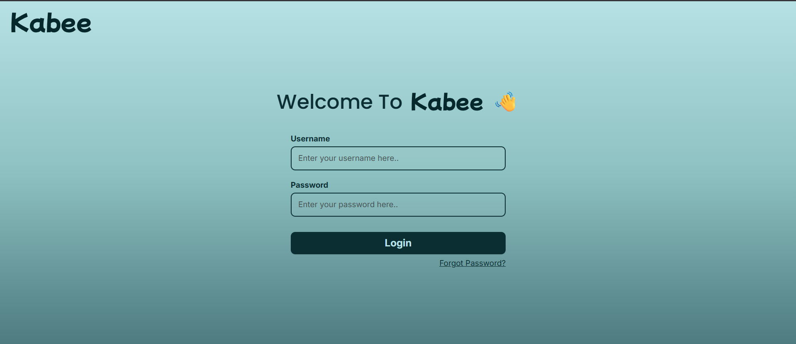
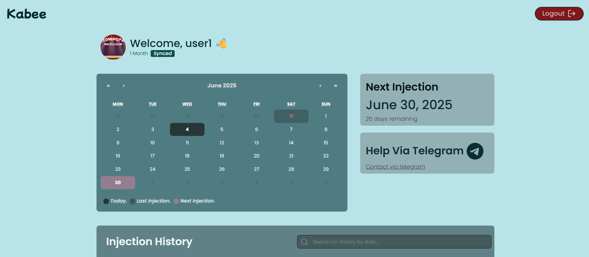
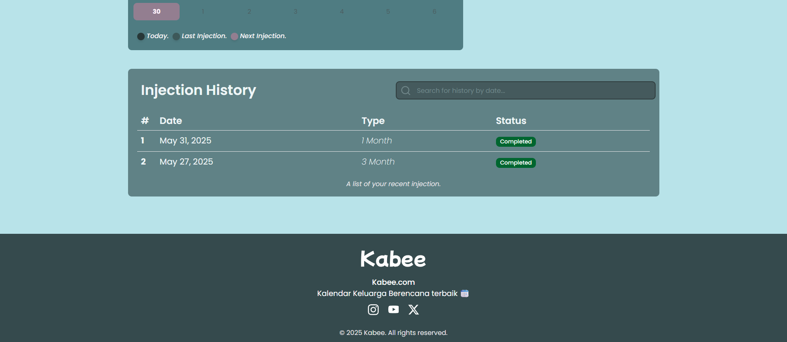
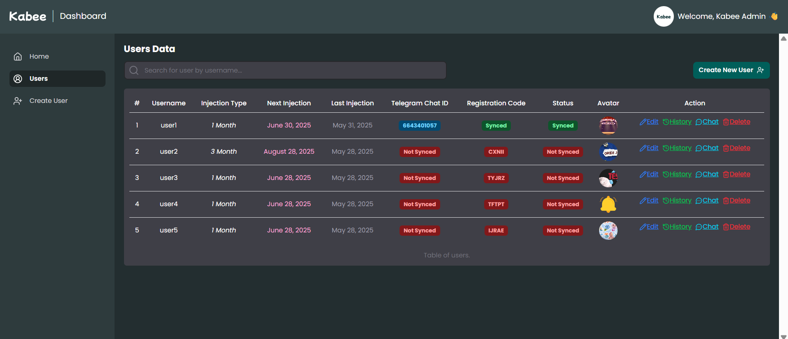
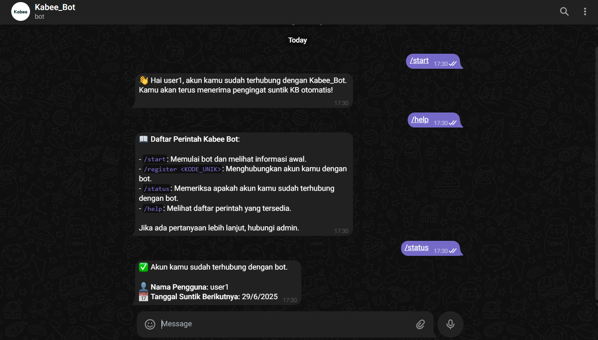

<h1 align="center">💉 KABEE-INJECTION-REMINDER-APP</h1>
<p align="center">A web-based KB injection reminder with Telegram bot integration</p>





<br/>

<p align="center">
  
  
</p>

<br/>

<p align="center"><i>Built with the tools and technologies:</i></p>

<p align="center">
  
  
  
  
  
  
  
  
  <br/>
  
  
  
  
  
  
  <br/>
  
  
</p>

Kabee adalah aplikasi pengingat suntik KB berbasis web yang mengirimkan notifikasi otomatis melalui Telegram, untuk membantu pengguna tidak melewatkan jadwal suntik mereka. Dikembangkan dengan stack MERN dan integrasi Bot Telegram yang cerdas.

---

## 📚 Table of Contents

- [✨ Features](#-features)
- [🧰 Tech Stack](#-tech-stack)
- [📂 Project Structure](#-project-structure)
- [⚙️ Getting Started](#-getting-started)
- [🔐 Environment Variables](#-environment-variables)
- [📡 Telegram Bot Integration](#-telegram-bot-integration)
- [🛠 API Endpoints](#-api-endpoints)
- [🖼 Screenshots](#-screenshots)
- [🧪 Testing](#-testing)
- [📄 License](#-license)

---

## ✨ Features

- 📝 Registrasi pengguna dengan kode unik
- 🗓 Input tanggal suntik KB berikutnya
- 🔔 Notifikasi otomatis via Bot Telegram
- ⏰ Penjadwalan pengingat harian dengan cron job
- 📊 Admin dashboard

---

## 🧰 Tech Stack

| Layer            | Teknologi                    |
| ---------------- | ---------------------------- |
| Frontend         | React, Tailwind CSS, Vite    |
| Backend          | Node.js, Express.js          |
| Database         | MongoDB, Mongoose            |
| Scheduler        | cron-job.org                 |
| Messaging        | Telegram Bot API             |
| Tools            | dotenv, axios, cors, nodemon |
| Auth             | JWT, Cookie                  |
| Fetching Data    | Axios                        |
| State Management | Zustand                      |
| Routing          | React Router 7               |
| Cloud Sorage          | Cloudinary              |

---

## 📂 Project Structure

```bash
kabee/
│
├── client/
│   ├── node_modules/
│   ├── public/
│   └── src/
│       ├── assets/         # Static assets (images, icons, etc.)
│       ├── components/     # Reusable React components
│       ├── helpers/        # Utility functions
│       ├── lib/            # External libraries or service configs
│       ├── pages/          # Page components (routing targets)
│       ├── routes/         # Route definitions or configs
│       ├── stores/         # State management (Zustand)
│       ├── styles/         # Global or modular styles (Tailwind)
│       ├── App.jsx         # Main app layout & router
│       └── main.jsx        # React entry point (mounting React DOM)
│
├── .env                   # Environment variables
└── index.html             # HTML template

│
├── server/                 # Express backend
│   ├── routes/            # API routes
│   ├── controllers/       # Logic handler
│   ├── models/            # Mongoose schemas
│   ├── jobs/              # Cron tasks
│   ├── services/          # Telegram bot logic
│   ├── .env               # Environment config
│   └── server.js
│
└── README.md
```

---

## ⚙️ Getting Started

### 1. Clone Repository

```bash
git clone https://github.com/kevinekarevano/Kabee-Injection-Reminder-App
cd Kabee-Injection-Reminder-App
```

### 2. Install Dependencies

```bash
# Frontend
cd client
npm install

# Backend
cd ../server
npm install
```

### 3. Setup Environment Variables

Lihat [🔐 Environment Variables](#-environment-variables)

### 4. Run the Project

```bash
# Run backend
cd server
npm run dev

# Run frontend (in new terminal)
cd client
npm run dev
```

---

## 🔐 Environment Variables

Buat file `.env` di direktori `client` dan `server` :

```env
//CLIENT ENV
VITE_API_URL=http://localhost:5000
```

```env
//SERVER ENV


# App
NODE_ENV=development

# PORT
PORT=5000


# DB
MONGODB_URI=mongodb+srv://<username>:<password>@cluster.mongodb.net/kabee_db


# JWT
JWT_SECRET=<RANDOM_STRING>

# Cloudinary
CLOUDINARY_CLOUD_NAME=<YOUR_CLOUDINARY_NAME>
CLOUDINARY_API_KEY=<YOUR_CLOUDINARY_API_KEY>
CLOUDINARY_API_SECRET=<YOUR_CLOUDINARY_API_SECRET>
CLOUDINARY_URL=<YOUR_CLOUDINARY_URL>

# TELEGRAM
TELEGRAM_TOKEN=<YOUR_TELEGRAM_TOKEN>

# Client
CLIENT_URL=http://localhost:5173

# CRON SECRET
CRON_SECRET=<RANDOM_STRING>
```

---

## 📡 Telegram Bot Integration

1. Buat bot di [@BotFather](https://t.me/BotFather)
2. Salin token bot dan tambahkan ke file `.env`
3. Logika pengingat otomatis berada di folder `server/services/telegramBot.js`
4. Cron job akan berjalan setiap hari pukul 08:00 untuk memeriksa pengguna yang perlu diingatkan

---

## 🛠 API Endpoints

> Semua endpoint terdapat di folder `server/src/routers`

---

## 🖼 Screenshots

### 💻 Web Interface







<br/>
<br/>
<br/>

`Made with 💙 by kevin – empowering women with better health reminders.`
